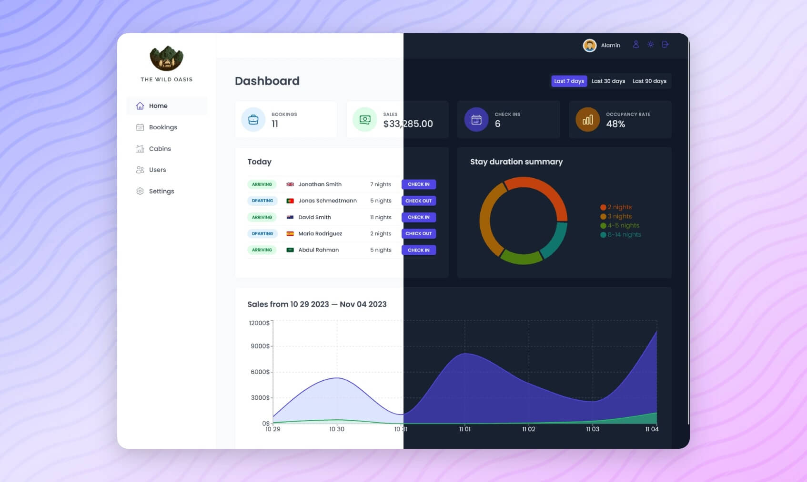

<div align="center">

  

  <h1>The Wild Oasis - Admin</h1>

  <h3>
    <a href="https://the-wild-oasis-six-wheat.vercel.app">
      <strong>Live Site</strong>
    </a>
  </h3>

  <div align="center">
    <a href="https://the-wild-oasis-six-wheat.vercel.app">View website</a>
    •
    <a href="https://github.com/omkarmagadumdev/The-Wild-Oasis/issues">Report Bug</a>
    •
    <a href="https://github.com/omkarmagadumdev/The-Wild-Oasis/pulls">Request Feature</a>
  </div>

  <hr>

</div>

<!-- Badges -->
<div align="center">


[](https://www.linkedin.com/in/omkar-magadum-729a4337a/)
[](https://x.com/Omkar_dev3141)

</div>

<!-- Brief -->
<p align="center">
Welcome to <b>The Wild Oasis</b>! This is a hotel management web app, where hotel employees can manage cabins, bookings, and guests. It uses Supabase as the backend and implements advanced React techniques such as HOCs and React Query.
</p>

<!-- Screenshot -->
<a align="center" href="https://the-wild-oasis-six-wheat.vercel.app">



</a>

## Live Site

Check out the live admin app here: [The Wild Oasis - Admin](https://the-wild-oasis-six-wheat.vercel.app)

## Customer Version

This repository contains the admin version of The Wild Oasis.

## Key Features

- User authentication ensures that only hotel employees can access the system.
- Employees can manage their profiles, including uploading avatars and changing passwords.
- The app features a dashboard showing recent stats on bookings, check-ins, and sales.
- Manage cabins with the ability to create, update, or delete cabin records.
- Handle bookings with the ability to check guests in and out, and update booking statuses.
- Real-time updates for cabins and bookings using Supabase.
- Visual statistics with charts displaying sales, occupancy rates, and other important data.
- Fully functional dark mode for a customized user experience.

## Technologies Used

- **React** for the frontend.
- **Supabase** for the database and real-time data updates.
- **React Query** for data fetching and caching.
- **React Router** for navigation.
- **React Hook Form** for efficient form handling.
- **Recharts** for data visualization (charts and stats).
- **Styled Components** for styling the UI, including dark mode.
- **Vite** for development environment and build system.

## What I Learned

This project was a deep dive into several advanced React concepts, including:

- **Authentication and Authorization:** Implementing Supabase to securely manage user roles (hotel employees).
- **Real-time Functionality:** Leveraging Supabase's real-time features for dynamic data updates.
- **State Management and Data Fetching:** Using React Query to efficiently manage the app's data flow.
- **Complex UI Patterns:** Implementing reusable patterns like the Compound Component Pattern and Higher-Order Components (HOC) to create more maintainable and scalable code.
- **Responsive and Adaptive Design:** Building a responsive user interface using Styled Components, making sure it works well on different devices and screen sizes.
- **Dark Mode:** Adding dark mode functionality for a personalized user experience.
- **Data Visualization:** Using Recharts to create meaningful visual representations of hotel statistics.

## Setup Instructions

To run this project locally:

1. Clone the repo:
   ```bash
  git clone https://github.com/omkarmagadumdev/The-Wild-Oasis.git
   ```
2. Install dependencies:
   ```bash
   npm install
   ```
3. Set up environment variables:
   - Configure Supabase and add the necessary environment variables in a `.env` file. Check out the `.env.example` for reference.
4. Run the development server:
   ```bash
   npm run dev
   ```
5. Open [http://localhost:3000](http://localhost:3000) to see the app.

## Author

<b>👤 Omkar</b>

- LinkedIn - [@omkar-magadum-729a4337a](https://www.linkedin.com/in/omkar-magadum-729a4337a/)
- Twitter - [@Omkar_dev3141](https://x.com/Omkar_dev3141)
- GitHub - [@omkarmagadumdev](https://github.com/omkarmagadumdev)

Feel free to contact me with any questions or feedback!

